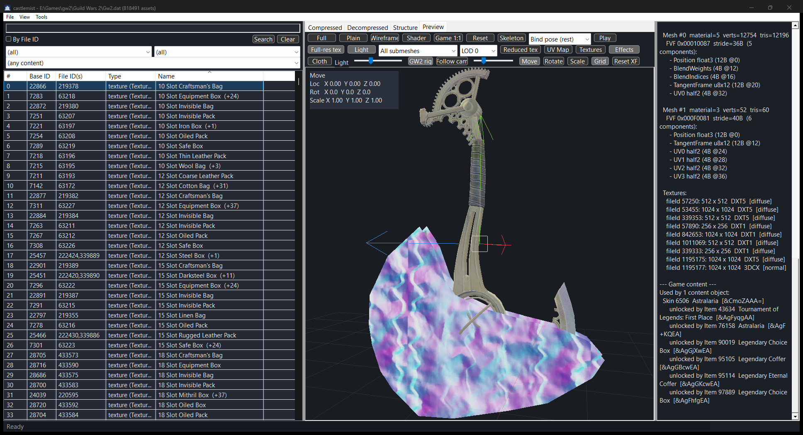
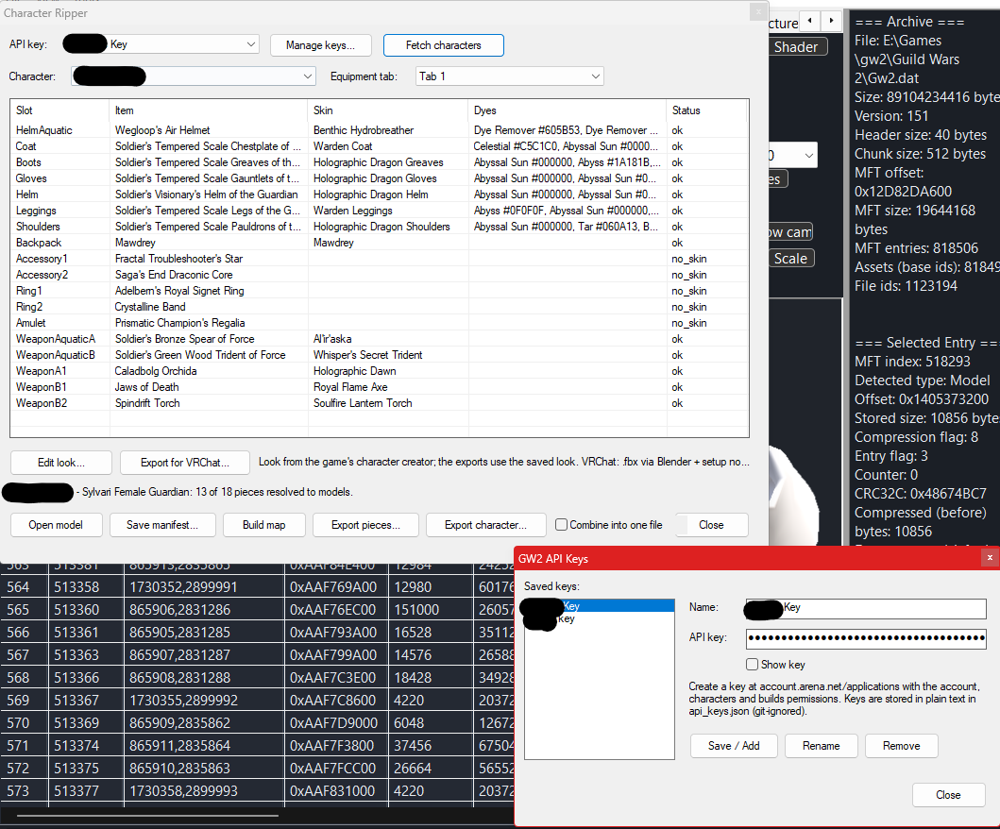
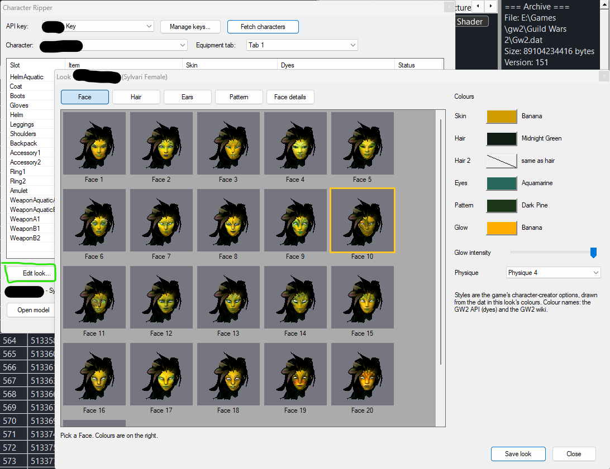
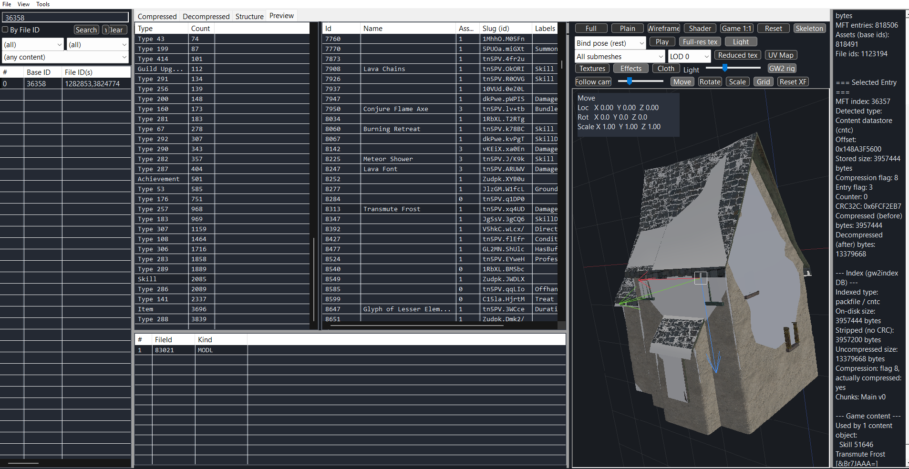

# castlemist

An explorer for the Guild Wars 2 `.dat` archive. Browse the MFT, decode the
formats inside it, and preview textures, models, maps, audio and video without
launching the game. This fork also adds a **Character Ripper**: it fetches a
character through the official GW2 API and rebuilds it from your own Gw2.dat as
a rigged, dyed model, ready for Blender or VRChat.

Win32 + Direct3D 11, C++20, built with MinGW-w64.

> **Credits.** castlemist was created by **Ridwan Hidayatullah**
> ([R-Hidayatullah/castlemist](https://github.com/R-Hidayatullah/castlemist)).
> He wrote the archive explorer, the format decoders, the renderers and the
> reverse-engineering notes this is all built on. This repository is
> [Shelby Jenkins](https://github.com/spjinx)'s fork, which adds the Character
> Ripper, the VRChat export, glTF export, and game names and chat links in the
> browser. Fork development was assisted by
> [Claude Code](https://claude.com/claude-code).
> See [What came from where](#what-came-from-where).



The Astralaria skin model. The file list is sorted by in-game name, and the
right-hand panel shows what uses the model: skin 6506 "Astralaria" with its chat
link `[&CmoZAAA=]`, and every item that unlocks it.

## Character Ripper *(fork)*



**Tools > Character Ripper...** takes a GW2 API key (scopes `account`,
`characters` and `builds`), lists your characters, and resolves what one is
wearing to skins, dyes and dat files. From there:

- **Export pieces...** writes each armor piece, weapon and back item as its own
  race-correct, dyed `.glb`.
- **Export character...** assembles the whole character onto one skeleton as a
  single rigged, upright `.glb`. This covers the body, armor, the weapon kit on
  its holsters, undergarments, and cloth such as hair fronds, capes and skirt
  tails.
- **Edit look...** sets face, hair style, ears, skin pattern and every colour
  from the game's own palettes. It shows picture grids for each choice, has the
  face-detail sliders (exported as blend shapes) and supports physiques.
- **Export for VRChat...** builds a humanoid avatar FBX through Blender. Body,
  hair and armor get their own materials, and skin and hair alpha become
  cut-outs.



API keys are stored locally in plain JSON and sent only to
`api.guildwars2.com`. Everything the model is built from comes from your own
Gw2.dat.

## Game names and chat links *(fork)*

The dat addresses everything by file id, but the game and the API use item,
skin and map ids. castlemist bridges the two through the game's content
datastore (cntc), in both directions:

- **Info panel > Game content:** the items, skins, outfits, mount skins, maps,
  achievements and skills that use the selected file. Each one comes with its
  name, its chat link and the items that unlock it.
- **File list > Name column:** every file that something in the game uses shows
  that thing's name. `(+N)` means N more objects share it. Sort by it to browse
  the archive A–Z.
- **Search by name:** type a name (anything that isn't just digits) into the
  search box. The list narrows to every file used by something whose name
  contains it, combined with the index's type and container filters.
- **Content browser:** Name and API id columns for every content object.
- **Tools > Decode Chat Link...** goes the other way: paste a link and jump to
  its assets.



Names come from the public GW2 API, which needs no key, and are cached in
`content_names.tsv` beside the exe. **Tools > Download all game names**
downloads every name at once: about 168,000 objects, paced under the API's rate
limit, which takes a while the first time. Building an index runs it
automatically. After that, browsing and searching never wait on the network.
Without it, names are fetched for the rows you scroll to.

## What it previews

| | |
| --- | --- |
|  |  |
| **Textures**: ATEX/ATEP/ATEU/ATET and standalone DDS decoded to RGBA, with the alpha channel toggleable. | **PIMG atlases**: paged image tables composited into a single preview. |
|  |  |
| **String tables**: raw UTF-16 records decode directly; packed ones are RC4-encrypted per stringId and are marked as such rather than shown as wrong text. | **Content datastores**: cntc records browsed by type, with each entry's assets and fields. |


Models (MODL) are shown with their materials resolved, LODs, skeleton and
embedded animation, cloth, and the transform gizmo. A "Game 1:1" surface renders
them with the engine's own shaders. Maps, audio banks and Bink cinematics have
their own previews.

Every panel is driven by what the extractor detected, so an unrecognised entry
falls back to a hex view rather than an error. The right-hand pane always shows
the archive header and the raw MFT record. When an index has been built, it also
shows what `gw2index` recorded for that entry, including whether its compression
flag told the truth.

## Themes

Dark by default, light, or a custom accent: **View > Theme**. The custom mode
picks its base palette from the accent's luminance, so a bright accent lands on
a light base and a dark one on a dark base.

> Two controls, the search box and the tab strip, still render light in dark
> mode. They are common controls that ignore the brush from `WM_CTLCOLOR*` and
> are not covered by Windows' `DarkMode_*` themes; fixing them properly means
> owner-drawing both.

## Getting started

New to castlemist? **[docs/getting-started.md](docs/getting-started.md)** goes
from a fresh PC to searching the archive by item name: installing the
toolchain, fetching the libraries with one script, building, generating the
struct template with Ghidra ([docs/struct-template.md](docs/struct-template.md)),
building the index, and downloading the game names. After that,
[docs/using-castlemist.md](docs/using-castlemist.md) tours every panel and
[docs/troubleshooting.md](docs/troubleshooting.md) covers what goes wrong.

## Running it

```bash
castlemist.exe
```

Or open an archive, and optionally an entry, straight away:

```bash
castlemist.exe "C:/Program Files (x86)/Steam/steamapps/common/Guild Wars 2/Gw2.dat" 2871
```

The second argument is a **baseId**. The ids in
[`docs/research/curated-test-ids.txt`](docs/research/curated-test-ids.txt) are
baseIds; mixing them up with fileIds is the usual reason a known-good id
resolves to something unexpected.

The command-line tool covers the same ground headlessly, for example:

```bash
gw2dat_cli users --file-id 1200313 --names        # what uses a file, with names and chat links
gw2dat_cli character --key-name main               # characters on a stored API key
gw2dat_cli character-assemble --manifest m.json --dat Gw2.dat --out char.glb
```

## Layout

| directory   | what lives there                                                    |
| ----------- | ------------------------------------------------------------------- |
| `src/`      | the application, one directory per layer (see below)                 |
| `include/`  | public headers, always included as `castlemist/<layer>/<file>.h`      |
| `tests/`    | unit tests, one file per layer, run with `ctest`                     |
| `tools/`    | standalone dump / convert / probe utilities (indexer, dat CLI, shader and strs extractors, the Blender VRChat script, in-process hooks) |
| `mcp/`      | Model Context Protocol servers exposing the dat, the index and RenderDoc captures to an agent |
| `docs/`     | architecture, build and testing guides plus the reverse-engineering notes |
| `dumps/`    | where the tools write their output (untracked; generate your own)    |
| `external/` | third-party libraries (untracked; see `external/README.md`)          |

## The stack

Dependencies point downward only. Nothing below `ui` may include a ui header,
and nothing below `render` may touch Direct3D.

```
app       WinMain, the process entry point                    (castlemist.exe)
 +-- ui       Win32 shell: window procs, widgets, layout, content browser, Character Ripper
      +-- ripper   character assembly: atlas, dyes, looks, physiques, VRChat   (fork)
      |    +-- exportgltf   glTF writer for models, maps and characters        (fork)
      +-- character  GW2 API client, key store, manifest                      (fork)
      +-- render   Direct3D 11 image / model / scene renderers
      |    +-- sim      the reverse-engineered GW2 cloth solver
      +-- extract  MFT entry -> previewable payload (the format dispatcher)
      |    +-- media    audio (dr_mp3 / stb_vorbis) and Bink video playback
      |    +-- format   single-format decoders (dds, strs, chat links, content map, composite, ...)
      +-- db       SQLite reader for the index that tools/gw2index builds
           +-- core     byte readers and other dependency-free helpers
                +-- native  GW2 dat/MFT, method-0 codec, ATEX, MODL, granny
```

Each layer builds as its own DLL in the development presets, so editing one
file relinks one DLL rather than the whole program. The release presets archive
everything into a single self-contained executable.

## Building

Needs MinGW-w64 (GCC 13+), CMake 3.21+, Ninja, and the libraries listed in
[`external/README.md`](external/README.md), which one script fetches:

```powershell
powershell -ExecutionPolicy Bypass -File tools\setup\fetch_externals.ps1 -WithBgfx
```

With MSYS2, put `C:\msys64\ucrt64\bin` on `PATH` first; without it g++ fails with no
message. The VRChat export also needs [Blender](https://www.blender.org/).
Step by step: [docs/getting-started.md](docs/getting-started.md).

```bash
cmake --preset debug
```

```bash
cmake --build --preset debug
```

```bash
ctest --preset debug
```

Presets: `debug`, `relwithdebinfo` (both DLL layers), `release`, `minsizerel`
(both a single static exe), and `ci`. Full details, including the MinGW runtime
pitfall that shows up as `0xC0000139` at startup, are in
[`docs/building.md`](docs/building.md).

## Where the knowledge is

castlemist is the readable form of a long reverse-engineering effort: the
formats it parses were recovered from the client binary, not from documentation.
[`docs/research/`](docs/research) holds those notes: the dat's Huffman codec,
the ATEX container, MODL geometry and skinning, the map heightmap tiling, the
particle and cloth solvers, the string-table RC4, the shader cache layout, chat
links and the content datastore. Each one explains what the code does and, more
usefully, why it looks the way it does. Designs and plans for the Character
Ripper are in [`docs/superpowers/`](docs/superpowers).

## What came from where

| | |
| --- | --- |
| **Ridwan Hidayatullah**, original author ([upstream](https://github.com/R-Hidayatullah/castlemist)) | The archive explorer and everything under it: dat/MFT reading, the method-0 codec, ATEX/MODL/granny decoding, the format dispatcher and previews, the Direct3D renderers, the "Game 1:1" bgfx surface, the cloth solver, maps, audio and Bink playback, the gw2index indexer, the MCP servers, the chat-link decoder, the first content-map (cntc) parser, and the research notes. |
| **Shelby Jenkins**, this fork | The `character`, `ripper` and `exportgltf` layers: the Character Ripper and its dialogs, character assembly, dyes and looks, the VRChat export, glTF model/map export with material baking, the content map's item/skin links, skin tokens and colour palettes, and game names and chat links across the browser. |

Third-party libraries, each under its own licence: [nlohmann/json](https://github.com/nlohmann/json),
[SQLite](https://sqlite.org), [stb](https://github.com/nothings/stb),
[dr_libs](https://github.com/mackron/dr_libs),
[libjpeg-turbo](https://github.com/libjpeg-turbo/libjpeg-turbo),
[libwebp](https://chromium.googlesource.com/webm/libwebp),
[GLM](https://github.com/g-truc/glm), [xatlas](https://github.com/jpcy/xatlas),
and the Bink 2 headers. See [`external/README.md`](external/README.md).

## Licence

MIT. See [LICENSE](LICENSE).

Not affiliated with or endorsed by ArenaNet or NCSOFT. Guild Wars 2 and its
assets are their property. castlemist ships none of them and reads only files
you already have. Character data comes from the official
[GW2 API](https://wiki.guildwars2.com/wiki/API:Main) with your own key.
